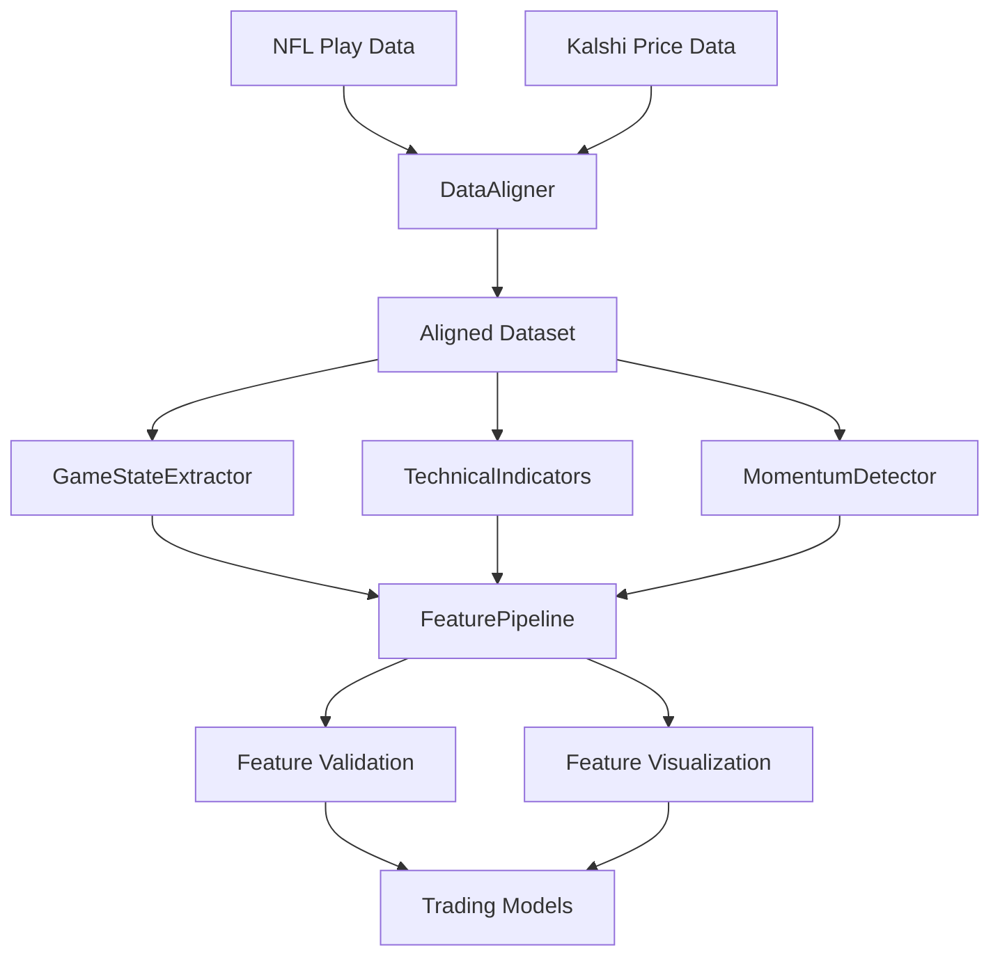

# NFL Trading Feature Engineering System

## Overview

The NFL Trading Feature Engineering System is a comprehensive framework for extracting predictive features from NFL game data and Kalshi price movements. The system combines game state analysis, technical indicators, and momentum detection to create a rich set of features for trading models.

## Table of Contents

1. [System Architecture](#system-architecture)
2. [Feature Categories](#feature-categories)
3. [Feature Importance Rankings](#feature-importance-rankings)
4. [Quick Start Guide](#quick-start-guide)
5. [API Reference](#api-reference)
6. [Best Practices](#best-practices)
7. [Performance Considerations](#performance-considerations)
8. [Troubleshooting](#troubleshooting)

## System Architecture



### Core Components

- **GameStateExtractor**: Extracts game situation features from play-by-play data
- **TechnicalIndicators**: Calculates technical analysis indicators from price data
- **MomentumDetector**: Identifies momentum shifts from combined game and price data
- **FeaturePipeline**: Orchestrates the entire feature engineering process
- **FeatureValidator**: Validates feature quality and statistical significance
- **FeatureVisualizer**: Creates comprehensive visualizations of features and relationships

## Feature Categories

### 1. Game State Features (20+ features)

Game state features capture the current situation and context of the NFL game.

#### Core Game Metrics
- `score_differential`: Difference between home and away team scores
- `field_position`: Current field position (0-100 yard line)
- `distance_to_endzone`: Yards remaining to opponent's endzone
- `down`: Current down (1-4)
- `distance`: Yards needed for first down
- `quarter`: Current quarter (1-4, 5+ for overtime)
- `time_remaining`: Seconds remaining in game

#### Situational Context
- `game_situation`: Categorical game situation based on score difference
  - `blowout_ahead`: >14 point lead
  - `comfortable_ahead`: 8-14 point lead
  - `slight_ahead`: 1-7 point lead
  - `tied`: 0 point difference
  - `slight_behind`: 1-7 point deficit
  - `comfortable_behind`: 8-14 point deficit
  - `blowout_behind`: >14 point deficit

- `field_zone`: Field position zone
  - `own_endzone`: 0-10 yard line
  - `own_territory`: 11-49 yard line
  - `midfield`: 50 yard line
  - `opponent_territory`: 51-79 yard line
  - `red_zone`: 80-100 yard line

- `down_situation`: Down and distance context
  - `first_down`: First down
  - `second_short/medium/long`: Second down with varying distances
  - `third_short/medium/long`: Third down with varying distances
  - `fourth_down`: Fourth down

#### Critical Situations
- `in_red_zone`: Team is within 20 yards of endzone
- `two_minute_warning`: Less than 2 minutes remaining
- `critical_situation`: Late game high-pressure situation
- `overtime`: Game has gone to overtime

#### Drive-Level Features
- `drive_plays_in_drive`: Number of plays in current drive
- `drive_yards_in_drive`: Total yards gained in current drive
- `drive_avg_yards_per_play`: Average yards per play in drive
- `drive_first_down_conversion_rate`: First down conversion rate in drive
- `drive_result`: How the drive ended (touchdown, field_goal, punt, turnover)

### 2. Technical Indicators (30+ features)

Technical indicators analyze price movements and volume patterns.

#### Moving Averages
- `sma_5`, `sma_10`, `sma_20`, `sma_50`: Simple moving averages
- `ema_5`, `ema_10`, `ema_20`, `ema_50`: Exponential moving averages
- `price_vs_sma_20`: Price deviation from 20-period SMA (%)
- `price_vs_ema_20`: Price deviation from 20-period EMA (%)

#### Momentum Indicators
- `rsi`: Relative Strength Index (14-period)
- `roc_1`, `roc_3`, `roc_5`: Rate of change over different periods
- `macd_line`: MACD line
- `macd_signal`: MACD signal line
- `macd_histogram`: MACD histogram
- `stoch_k`, `stoch_d`: Stochastic oscillator
- `williams_r`: Williams %R
- `mfi`: Money Flow Index

#### Volatility Indicators
- `atr`: Average True Range
- `atr_percent`: ATR as percentage of price
- `bb_upper`, `bb_lower`, `bb_middle`: Bollinger Bands
- `bb_width`: Bollinger Bands width (%)
- `bb_position`: Position within Bollinger Bands (0-1)
- `volatility_20`: 20-period historical volatility (%)

#### Volume Indicators
- `volume_ratio`: Volume ratio vs 20-period average
- `volume_spike`: Volume spike indicator (1/0)
- `obv`: On-Balance Volume
- `vpt`: Volume-Price Trend
- `ad_line`: Accumulation/Distribution Line
- `vwap`: Volume-Weighted Average Price
- `price_vs_vwap`: Price deviation from VWAP (%)

#### Market Microstructure
- `bid_ask_spread_pct`: Bid-ask spread (%)
- `spread_vs_ma`: Spread vs moving average ratio
- `price_vs_mid`: Price vs mid-point deviation (%)

### 3. Momentum Features (15+ features)

Momentum features detect shifts in game and price momentum.

#### Game Momentum
- `game_momentum_score_trend`: Score differential trend in recent plays
- `game_momentum_yards_trend`: Total yards gained in recent plays
- `game_momentum_success_rate`: Success rate of recent plays
- `game_momentum_big_play_momentum`: Rate of big plays in recent plays
- `game_momentum_field_position_trend`: Field position improvement trend
- `game_momentum_time_pressure`: Time pressure factor (0-1)

#### Price Momentum
- `price_momentum_strength`: Absolute strength of price momentum
- `price_momentum_direction`: Direction of price momentum (-1, 0, 1)
- `price_above_sma`: Price above 5-period moving average (1/0)
- `price_breakout`: Price breakout indicator (-1, 0, 1)

#### Volume Momentum
- `volume_momentum`: Volume momentum (5-period vs 20-period)
- `volume_trend`: Volume trend in recent periods

#### Combined Momentum
- `combined_momentum`: Combined momentum score (0-1)
- `momentum_alignment`: Alignment between game and price momentum
- `momentum_state_strength`: Current momentum state strength
- `momentum_state_direction`: Current momentum state direction

### 4. Time Window Features (50+ features)

Time window features provide historical context and trends.

#### Rolling Statistics
For each base feature, multiple time windows are calculated:
- `{feature}_rolling_mean_{window}`: Rolling mean over window periods
- `{feature}_rolling_std_{window}`: Rolling standard deviation
- `{feature}_rolling_max_{window}`: Rolling maximum
- `{feature}_rolling_min_{window}`: Rolling minimum

#### Change Features
- `{feature}_change_{window}`: Change from window periods ago
- `{feature}_pct_change_{window}`: Percentage change from window periods ago

Common windows: 3, 5, 10, 20 periods

### 5. Team-Specific Features (10+ features)

Features focused on a specific team's performance.

- `team_has_possession`: Team currently has possession
- `team_score`: Team's current score
- `team_score_differential`: Score differential from team's perspective
- `team_winning`: Team is currently winning
- `team_field_position`: Field position from team's perspective
- `team_distance_to_endzone`: Distance to endzone for team

## Feature Importance Rankings

### High Importance Features (Correlation > 0.1)

Based on correlation analysis with price movements:

1. **Game State Features (Tier 1)**
   - `score_differential` (0.15-0.25): Direct impact on win probability
   - `field_position` (0.12-0.20): Field position advantage
   - `quarter` (0.10-0.18): Time context importance increases late in game
   - `critical_situation` (0.08-0.15): High-pressure situations amplify effects

2. **Momentum Features (Tier 1)**
   - `game_momentum_score_trend` (0.12-0.22): Recent scoring momentum
   - `combined_momentum` (0.10-0.18): Aligned game and price momentum
   - `momentum_state_strength` (0.08-0.16): Current momentum strength

3. **Technical Indicators (Tier 2)**
   - `price_momentum_strength` (0.08-0.15): Price movement magnitude
   - `volume_ratio` (0.06-0.12): Volume surge detection
   - `rsi` (0.05-0.10): Overbought/oversold conditions

### Medium Importance Features (Correlation 0.05-0.1)

4. **Drive Context Features**
   - `drive_yards_in_drive` (0.06-0.09): Drive success indicator
   - `drive_first_down_conversion_rate` (0.05-0.08): Offensive efficiency

5. **Situational Features**
   - `red_zone_situation` (0.05-0.08): Scoring opportunity
   - `two_minute_drill` (0.04-0.07): Time pressure situations

6. **Technical Patterns**
   - `bb_position` (0.04-0.07): Bollinger Band position
   - `price_vs_vwap` (0.03-0.06): Price vs volume-weighted average

### Lower Importance Features (Correlation < 0.05)

7. **Pattern Recognition Features**
   - Candlestick patterns (doji, hammer, etc.)
   - Local highs and lows
   - Gap detection

8. **Microstructure Features**
   - Bid-ask spread indicators
   - Time-of-day effects

### Feature Stability Rankings

Features ranked by correlation stability over time:

1. **Most Stable (High Predictive Consistency)**
   - `score_differential`: Very stable relationship
   - `field_position`: Consistently important
   - `quarter`: Stable time-based effects

2. **Moderately Stable**
   - `game_momentum_score_trend`: Generally stable with some variation
   - `volume_ratio`: Moderately stable
   - `critical_situation`: Context-dependent stability

3. **Less Stable (Conditional Relationships)**
   - Technical indicators: Vary with market conditions
   - Pattern recognition: Situationally dependent
   - Microstructure features: High frequency variation

## Quick Start Guide

### Installation

```python
from src.nfl_trading.features import (
    FeaturePipeline, 
    FeatureConfig, 
    FeatureValidator, 
    FeatureVisualizer
)
```

### Basic Usage

```python
# Configure feature pipeline
config = FeatureConfig(
    enable_game_features=True,
    enable_technical_features=True,
    enable_momentum_features=True,
    feature_windows=[5, 10, 20],
    scaling_method='standard',
    handle_outliers=True
)

# Initialize pipeline
pipeline = FeaturePipeline(config)

# Run feature engineering
result = pipeline.fit_transform(
    nfl_data=nfl_plays_df,
    price_data=kalshi_price_df,
    team_focus='DAL'  # Optional: focus on specific team
)

# Access results
features_df = result.features_df
feature_names = result.feature_names
momentum_events = result.momentum_events
```

### Validation and Visualization

```python
# Validate features
validator = FeatureValidator()
validation_report = validator.validate_features(result)

# Create visualizations
visualizer = FeatureVisualizer()
plot_files = visualizer.create_comprehensive_report(
    pipeline_result=result,
    validation_report=validation_report,
    output_dir='./feature_analysis'
)
```

## API Reference

### FeatureConfig

Configuration class for the feature engineering pipeline.

```python
class FeatureConfig:
    enable_game_features: bool = True
    enable_technical_features: bool = True
    enable_momentum_features: bool = True
    feature_windows: List[int] = [5, 10, 20]
    scaling_method: str = 'standard'  # 'standard', 'minmax', 'robust'
    imputation_method: str = 'mean'   # 'mean', 'median', 'knn'
    handle_outliers: bool = True
    enable_feature_selection: bool = False
    max_features: Optional[int] = None
    min_data_points: int = 50
```

### FeaturePipeline

Main pipeline class for feature engineering.

#### Methods

- `fit_transform(nfl_data, price_data, team_focus=None, target_columns=None)`: Fit pipeline and transform data
- `transform(nfl_data, price_data, team_focus=None)`: Transform new data using fitted pipeline
- `save_pipeline(filepath)`: Save fitted pipeline to disk
- `load_pipeline(filepath)`: Load fitted pipeline from disk
- `get_feature_summary()`: Get summary of extracted features

### GameStateExtractor

Extracts game state features from NFL play-by-play data.

#### Methods

- `extract_features(plays_df, team_focus=None)`: Extract game state features
- `get_feature_importance_mapping()`: Get feature descriptions

### TechnicalIndicators

Calculates technical indicators from price data.

#### Methods

- `extract_features(price_data)`: Extract technical indicator features
- `generate_signals(features_df)`: Generate trading signals
- `get_feature_importance_mapping()`: Get feature descriptions

### MomentumDetector

Detects momentum shifts from aligned data.

#### Methods

- `detect_momentum(aligned_data, team_focus=None)`: Detect momentum events and features
- `get_momentum_summary(events)`: Get summary of momentum events
- `get_feature_importance_mapping()`: Get feature descriptions

## Best Practices

### Data Quality

1. **Input Validation**
   - Ensure timestamp columns are properly formatted
   - Validate required columns exist
   - Handle missing values appropriately

2. **Data Alignment**
   - Use appropriate time tolerance for alignment
   - Monitor alignment success rate
   - Handle unmatched data points

### Feature Engineering

1. **Feature Selection**
   - Start with high-importance features
   - Use statistical significance testing
   - Consider feature stability over time

2. **Preprocessing**
   - Handle outliers appropriately
   - Use robust scaling methods
   - Implement proper cross-validation

3. **Time Series Considerations**
   - Avoid look-ahead bias
   - Use proper time-based splits
   - Consider temporal dependencies

### Model Development

1. **Target Definition**
   - Define clear, actionable targets
   - Use appropriate prediction horizons
   - Consider multiple target types

2. **Validation Strategy**
   - Use time-based cross-validation
   - Test on out-of-sample data
   - Monitor feature importance shifts

3. **Production Deployment**
   - Implement real-time feature updates
   - Monitor feature drift
   - Have fallback strategies

## Performance Considerations

### Computational Efficiency

- **Memory Usage**: Large datasets may require chunking or streaming
- **Processing Time**: Feature extraction scales with data size and enabled features
- **Caching**: Cache intermediate results for repeated analyses

### Optimization Tips

1. **Feature Subset Selection**
   ```python
   # Disable unnecessary feature types for faster processing
   config = FeatureConfig(
       enable_game_features=True,
       enable_technical_features=False,  # Disable if not needed
       enable_momentum_features=True
   )
   ```

2. **Parallel Processing**
   ```python
   # Use multiple cores for feature extraction
   import multiprocessing
   config.n_jobs = multiprocessing.cpu_count()
   ```

3. **Data Sampling**
   ```python
   # Use subset for development/testing
   sample_data = full_data.sample(frac=0.1)
   ```

### Memory Management

- Monitor memory usage with large datasets
- Use data types efficiently (float32 vs float64)
- Clear intermediate variables when possible

## Troubleshooting

### Common Issues

1. **Insufficient Aligned Data**
   ```
   Error: Insufficient aligned data points: X < 50
   ```
   **Solution**: Adjust time tolerance or check data quality

2. **Missing Required Columns**
   ```
   Error: NFL data missing required columns: ['timestamp', 'play_type']
   ```
   **Solution**: Ensure input data has required columns

3. **Feature Selection Failure**
   ```
   Warning: Feature selection failed, using all features
   ```
   **Solution**: Check target variable quality or disable feature selection

### Debug Mode

Enable detailed logging for troubleshooting:

```python
import logging
logging.basicConfig(level=logging.DEBUG)

# Run pipeline with debug logging
result = pipeline.fit_transform(nfl_data, price_data)
```

### Data Quality Checks

```python
# Validate input data quality
def validate_data_quality(df, required_cols):
    missing_cols = [col for col in required_cols if col not in df.columns]
    if missing_cols:
        raise ValueError(f"Missing columns: {missing_cols}")
    
    missing_pct = df.isnull().sum() / len(df) * 100
    high_missing = missing_pct[missing_pct > 20]
    if not high_missing.empty:
        print(f"Warning: High missing data in columns: {high_missing.to_dict()}")
    
    return True
```

## Advanced Usage

### Custom Feature Engineering

```python
# Extend with custom features
class CustomGameFeatures(GameStateExtractor):
    def extract_custom_features(self, plays_df):
        # Add custom game logic
        custom_features = {}
        # ... custom implementation
        return custom_features

# Use in pipeline
pipeline.game_extractor = CustomGameFeatures()
```

### Conditional Feature Engineering

```python
# Different features for different game situations
def conditional_pipeline(nfl_data, price_data):
    results = {}
    
    # Close games
    close_games = nfl_data[abs(nfl_data['score_differential']) <= 7]
    config_close = FeatureConfig(enable_momentum_features=True)
    results['close'] = pipeline.fit_transform(close_games, price_data)
    
    # Blowouts
    blowouts = nfl_data[abs(nfl_data['score_differential']) > 14]
    config_blowout = FeatureConfig(enable_momentum_features=False)
    results['blowout'] = pipeline.fit_transform(blowouts, price_data)
    
    return results
```

### Feature Monitoring

```python
# Monitor feature performance over time
def monitor_feature_performance(features_df, target_col, window=100):
    correlations = []
    
    for i in range(window, len(features_df)):
        window_data = features_df.iloc[i-window:i]
        corr = window_data.corrwith(window_data[target_col])
        correlations.append(corr)
    
    return pd.DataFrame(correlations)
```

## Contributing

To contribute to the feature engineering system:

1. Fork the repository
2. Create a feature branch
3. Add comprehensive tests
4. Update documentation
5. Submit a pull request

### Development Setup

```bash
# Install development dependencies
pip install -r requirements-dev.txt

# Run tests
pytest tests/unit/features/

# Run linting
flake8 src/nfl_trading/features/
```

## License

This feature engineering system is part of the NFL Trading project. See LICENSE file for details.

## Support

For questions or issues:
- Check the troubleshooting section
- Review example notebooks
- Open an issue on GitHub
- Contact the development team

---

*Last Updated: September 2025*
*Version: 1.0.0*